+++
date = "2023-06-25"
title = "Measuring the carbon footprint of pizzas"
tags = ['sustainability', 'python']
images = ["/img/blog/carbon-footprint-pizzas/cover.png"]
+++

Making environmentally friendly decisions can only be done with the right information. At Carbonfact, we've realized a big challenge is the lack of information about industrial processes. We tackle that slowly but surely by gathering data from various sources, and making it available to our customers.

Regarding food, the French government has a great initiative called [Agribalyse](https://agribalyse.ademe.fr/). It's a free database of environmental footprints for various food products. It includes raw ingredients straight out from the farm, as well as ready to eat dishes from the supermarket. It's a great initiative, as it allows anyone to do their own research and make informed decisions.

Agribalyse [shares](https://doc.agribalyse.fr/documentation/acces-donnees) its data in several format. The highest level tool is a [visual interface](https://agribalyse.ademe.fr/app/aliments?categories=entr%C3%A9es%20et%20plats%20compos%C3%A9s&search=pizza). You get a breakdown by ingredient when you click on a recipe. You can also see what stages are responsible for the footprint -- production, packaging, transport, etc. You also get access to various environmental indicators, [not just carbon](https://www.carbonfact.com/blog/research/carbon-tunnel). As a bonus, the taxonomy is aligned with that of the [Ciqual database](https://ciqual.anses.fr/#/aliments/25435), which provides nutritional information.

The interface's obvious downside is its static aspect. You can't compose your own meal. Also, some recipes are debatable. For instance, my definition of a _4 saisons_ is courgettes/eggplant/artichoke/pepper, which Agribalyse [doesn't](https://agribalyse.ademe.fr/app/aliments/25472#Pizza_aux_l%C3%A9gumes_ou_Pizza_4_saisons) agree with. To me, another issue is that scores are displayed by kilogram, which isn't intuitive for comparing meals with each other. It would be more natural to use a different [functional unit](https://consequential-lca.org/clca/the-functional-unit/define-the-functional-unit/), such as a serving or even a calorie. Both these issues can be solved by using the data directly, instead of relying on the interface.

The good news is that Agribalyse is [compatible](https://doc.agribalyse.fr/documentation/acces-donnees) with common life cycle assessment tools (LCA), including [Brightway2](https://documentation.brightway.dev/en/latest/index.html) in Python. This is as low-level as it gets, and should allow composing any recipe of your choosing. The downside is that these tools have a learning curve, and have their own linguo -- e.g. "activity", "exchange", "biosphere flow", etc. It's not as user friendly as the interface, but it's more flexible.

There is an in-between solution, which is an [Excel file](https://data.ademe.fr/data-fair/api/v1/datasets/agribalyse-31-synthese/metadata-attachments/AGRIBALYSE3.1_partie%20agriculture_conv_vf.xlsx) shared by Agribalyse. It's basically a machine readable format of what is displayed in the interface. This allows building the recipes from base ingredients, and measure the carbon -- or environmental -- footprint of a meal by yourself. This is how to load the data, and select the subset of columns corresponding to [CO2e](https://www.wikiwand.com/en/Global_warming_potential) emissions:

```py
import pandas as pd

agribalyse = pd.read_excel(
    '/Users/max/Downloads/AGRIBALYSE3.1_produits alimentaires_2.xlsm',
    sheet_name='Detail etape',
    header=[0, 1, 2],
)
co2e = agribalyse['Changement climatique']
co2e.columns = co2e.columns.get_level_values(1)
co2e = co2e.rename(columns={
    'Emballage': 'Packaging',
    'Supermarché et distribution': 'Distribution',
    'Consommation': 'Consumption',
})
co2e.index = co2e.iloc[:, 5]
co2e.index.name = ''
co2e.sample(3)
```

```
|                                         |   Agriculture |   Transformation |   Packaging |   Transport |   Distribution |   Consumption |   Total |
|-----------------------------------------|---------------|------------------|-------------|-------------|----------------|---------------|---------|
| Garden peas, raw                        |          0.43 |             0    |        0    |        0.22 |           0.02 |          0    |    0.67 |
| Soybean and wheat-based nuggets (vegan) |          0.36 |             0.62 |        0.18 |        0.18 |           0.03 |          0.09 |    1.47 |
| Rillettes from Tours                    |          4.29 |             0.54 |        0.33 |        0.13 |           0.02 |          0.01 |    5.31 |
```

This table contains emission for base ingredients:

```py
>>> co2e.loc['Garlic, fresh']
Agriculture       0.082554
Transformation    0.000000
Packaging         0.000000
Transport         0.173563
Distribution      0.019636
Consumption       0.080370
Total             0.356122

```

It also contains emissions for ready to eat meals:

```py
>>> co2e.loc['Pizza, goat cheese and lardoons']
Agriculture       2.830996
Transformation    0.300000
Packaging         0.104333
Transport         0.226394
Distribution      0.037393
Consumption       0.092757
Total             3.591873

```

As well as in-between ingredients, such as tomato sauce for a pizza:

```py
>>> co2e.loc['Tomato sauce for pizza base']
Agriculture       0.232973
Transformation    0.168029
Packaging         0.110054
Transport         0.190668
Distribution      0.019531
Consumption       0.000000
Total             0.721255

```

The nice thing is that you can mix and match these items to make your own recipes. One thing to know is that the values are expressed as amounts of CO2e by kilogram. This isn't very handy to manipulate, say, olive oil. I made myself a little framework in Python to ease the manipulation:

```py
import dataclasses

@dataclasses.dataclass
class Ingredient:
    name: str
    amount: float = 1

    @property
    def short_name(self):
        return self.name.split(',')[0]

    def __rmul__(self, amount):
        return Ingredient(self.name, self.amount * amount)

    def co2e(self, stage='Total'):
        return co2e.loc[self.name][stage] * self.amount

@dataclasses.dataclass
class Recipe(Ingredient):
    ingredients: list[Ingredient] = dataclasses.field(default_factory=list)

    def co2e(self, stage='Total'):
        return sum(
            ingredient.co2e(stage)
            for ingredient in self.ingredients
        )
```

This is far less advanced than Brightway2, but it's enough to compose a few base ingredients for making pizzas:

```py
g = 0.001
cl = 1

simple_dough = 265 * g * Ingredient('Pizza base, raw')
calzone_dough = 400 * g * Ingredient('Pizza base, raw')

red_base = Recipe('Red base', ingredients=[
    80 * g * Ingredient('Tomato sauce for pizza base'),
])
white_base = Recipe('White base', ingredients=[
    30 * g * Ingredient('cream sauce for pizza base')
])

# 1l = 0.92kg
olive_oil = (
    1.5 * cl * 0.92 * g
    * Ingredient('Olive oil, extra virgin')
)

# Two teaspoons of salt and pepper
salt_and_pepper = Recipe('Salt and pepper', ingredients=[
    0.5 * g * Ingredient('Salt, white, for human consumption (sea, igneous or rock), no enrichment'),
    0.3 * g * Ingredient('Black pepper, powder'),
])

# For seasoning
herbs = 0.4 * Ingredient('Provence herbs, dried')
basil = 5 * g * Ingredient('Basil, fresh')
```

I enjoy cooking, but I'm not experienced with making pizzas. Especially regarding quantities. So I found a few recipes online:

```py
# https://www.marmiton.org/recettes/recette_la-pizza-margherita-recette-realisable-a-la-maison_335446.aspx
margharita = Recipe('Margharita', ingredients=[
    simple_dough,
    red_base,
    olive_oil,
    salt_and_pepper,
    basil,
    125 * g * Ingredient("Mozzarella cheese, from cow's milk"),
    5 * g * Ingredient('Basil, fresh'),
    10 * g * Ingredient("Parmesan cheese, from cow's milk"),
])

# https://www.marmiton.org/recettes/recette_pizza-calzone-au-jambon-et-champignons_56497.aspx
# Replaced mushrooms with artichoke hearts
calzone = Recipe('Calzone', ingredients=[
    calzone_dough,
    red_base,
    olive_oil,
    salt_and_pepper,
    herbs,
    50 * g * Ingredient("Emmental cheese, grated, from cow's milk"),
    200 * g * Ingredient("Mozzarella cheese, from cow's milk"),
    250 * g * Ingredient('Cooked ham, Parisian-style, rind less and fatless'),
    30 * g * Ingredient('Olive, green, stuffed (anchovy, sweet peppers, etc…)'),
    100 * g * Ingredient('Artichoke, heart, canned, drained')
])

# https://www.marmiton.org/recettes/recette_pizza-aux-4-fromages-sauce-blanche_224832.aspx
four_cheeses = Recipe('Four cheeses', ingredients=[
    simple_dough,
    white_base,
    salt_and_pepper,
    basil,
    100 * g * Ingredient("Emmental cheese, grated, from cow's milk"),
    100 * g * Ingredient("Raclette cheese, from cow's milk"),
    125 * g * Ingredient("Mozzarella cheese, from cow's milk"),
    100 * g * Ingredient("Cheese, buche, from goat's milk"),
])

# https://www.marmiton.org/recettes/recette_pizza-aux-legumes_51726.aspx
# My favorite
vegetarian = Recipe('Four seasons', ingredients=[
    simple_dough,
    red_base,
    salt_and_pepper,
    basil,
    150 * g * Ingredient('Artichoke, heart, canned, drained'),
    150 * g * Ingredient('Eggplant, cooked'),
    150 * g * Ingredient('Courgette or zucchini, pulp and peel, cooked'),
    150 * g * Ingredient('Sweet pepper, red, cooked'),
    80 * g * Ingredient('Onion, cooked')
])

# https://cuisine.journaldesfemmes.fr/recette/317345-pizza-napolitaine
neapolitan = Recipe('Neapolitan', ingredients=[
    simple_dough,
    red_base,
    salt_and_pepper,
    basil,
    400 * g * Ingredient('Anchovy, fillets, rolled with capers, semi-preserved, drained'),
    100 * g * Ingredient("Emmental cheese, grated, from cow's milk"),
    30 * g * Ingredient('Olive, green, stuffed (anchovy, sweet peppers, etc…)'),
])
```

```py
pizzas = [
    margharita,
    calzone,
    four_cheeses,
    vegetarian,
    neapolitan,
]

for pizza in sorted(pizzas, key=lambda pizza: pizza.co2e(), reverse=True):
    print(f'{pizza.name:<15} {pizza.co2e():.2f}kg CO2e')
```

```
Calzone         4.37kg CO2e
Four cheeses    2.73kg CO2e
Neapolitan      1.72kg CO2e
Four seasons    1.24kg CO2e
Margharita      1.01kg CO2e
```

As expected the calzone is the worst offender. I'm surprised by the four cheeses pizza: I thought it would be worse, considering all that cheese is animal-based. The four seasons pizza is my favorite, and it's the best for the environment. I'm happy with that. The Neapolitan has anchovies, but is still way better than the Calzone, which has smoked pig ham.

This is only a contrived example of what you could do with this data. There's a lot of possible data visualizations. For instance, here's some code to extract the flows of CO2e for a Calzone pizza:

```py
def get_flows(item):
    if isinstance(item, Recipe):
        for ingredient in item.ingredients:
            yield (ingredient.short_name, item.short_name, ingredient.co2e())
            yield from get_flows(ingredient)
    else:
        for stage in (
            'Agriculture', 'Transformation', 'Packaging',
            'Transport', 'Distribution', 'Consumption'
        ):
            yield (stage, item.short_name, item.co2e(stage))

calzone_flows = list(get_flows(calzone))
len(calzone_flows)
```

```
79
```

And here's to how to display this as a [Mermaid](https://mermaid.js.org/syntax/flowchart.html) flowchart. I only displayed the top 20 flows to avoid clutter.

```py
import subprocess

flowchart = "flowchart LR"
ranking = sorted(calzone_flows, key=lambda x: x[2], reverse=True)
for i, (src, dst, co2) in enumerate(ranking[:20]):
    medal = '🥇🥈🥉'[i] if i < 3 else ''
    flowchart += (
        f"\n\t{src.replace(' ', '_')}({src})"
        f'-->|"{medal} {co2:.2f}kgCO2e"|'
        f"{dst.replace(' ', '_')}({dst})"
    )

subprocess.run('pbcopy', text=True, input=flowchart)
```

<br>



<br>

```mermaid
flowchart LR
	Cooked_ham(Cooked ham)-->|"🥇 1.78kgCO2e"|Calzone(Calzone)
	Agriculture(Agriculture)-->|"🥈 1.47kgCO2e"|Cooked_ham(Cooked ham)
	Mozzarella_cheese(Mozzarella cheese)-->|"🥉 0.93kgCO2e"|Calzone(Calzone)
	Agriculture(Agriculture)-->|" 0.77kgCO2e"|Mozzarella_cheese(Mozzarella cheese)
	Provence_herbs(Provence herbs)-->|" 0.62kgCO2e"|Calzone(Calzone)
	Pizza_base(Pizza base)-->|" 0.45kgCO2e"|Calzone(Calzone)
	Agriculture(Agriculture)-->|" 0.36kgCO2e"|Provence_herbs(Provence herbs)
	Emmental_cheese(Emmental cheese)-->|" 0.31kgCO2e"|Calzone(Calzone)
	Agriculture(Agriculture)-->|" 0.27kgCO2e"|Emmental_cheese(Emmental cheese)
	Packaging(Packaging)-->|" 0.19kgCO2e"|Provence_herbs(Provence herbs)
	Artichoke(Artichoke)-->|" 0.19kgCO2e"|Calzone(Calzone)
	Agriculture(Agriculture)-->|" 0.15kgCO2e"|Pizza_base(Pizza base)
	Transformation(Transformation)-->|" 0.12kgCO2e"|Cooked_ham(Cooked ham)
	Packaging(Packaging)-->|" 0.12kgCO2e"|Cooked_ham(Cooked ham)
	Packaging(Packaging)-->|" 0.11kgCO2e"|Pizza_base(Pizza base)
	Transport(Transport)-->|" 0.08kgCO2e"|Pizza_base(Pizza base)
	Transport(Transport)-->|" 0.07kgCO2e"|Provence_herbs(Provence herbs)
	Transformation(Transformation)-->|" 0.07kgCO2e"|Pizza_base(Pizza base)
	Agriculture(Agriculture)-->|" 0.07kgCO2e"|Artichoke(Artichoke)
	Transformation(Transformation)-->|" 0.06kgCO2e"|Mozzarella_cheese(Mozzarella cheese)
```

I think it's really cool what anyone with a bit of coding skills can get done nowadays. I'm excited to see what initiatives will spark from environmental datasets in open access. In particular, I believe putting this data into the hands of data scientists will reap interesting insights. I for one will be encouraging my university students to build projects on top of environmental datasets like this one.

As I mentionned earlier, the limits of this stuff is the quality and applicability of the underlying data. Agribalyse has done its best to produce representative [emission factors](https://www.climatiq.io/docs/guides/understanding/what-is-an-emission-factor). That is, they focused on products which most people can get access to in their supermarket. You can't really use this to measure the footprint of bespoke menus.

For instance, the ingredients in [Big Mamma pizzas](https://menu.bigmammagroup.com/popolare?categorie=pizza-napoletana) -- a bougie Italian restaurant chain in France -- come from specific Italian suppliers to France by truck every day. They also have special ovens for cooking pizzas in record time. It's impossible to know how much CO2e is emitted in this case, due to their specific processes. That's why there are companies like [Ecotable](https://ecotable.fr/) who do bespoke environmental labelling for restaurants. They start off with generic emission factors, and then focus on gathering primary data for the hotspot they identify. This is exactly what we do for clothes at Carbonfact.
